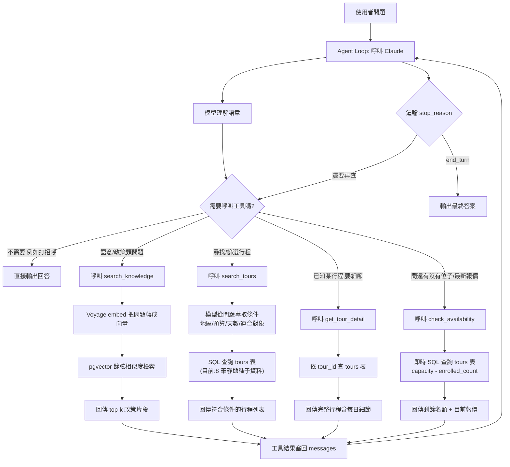

# Agentic RAG Travel Assistant

For a business-facing writeup of what was tested and what it found --
not this engineering README -- see
[`docs/POC_REPORT.md`](docs/POC_REPORT.md).

A multi-step agentic loop (Claude tool use) that routes between
semantic retrieval (RAG over a small travel-policy knowledge base) and
structured tool calls (querying a tour catalog), deciding autonomously
which path -- or how many steps -- a question needs. Implemented
twice: once hand-rolled (no framework, to demonstrate the mechanics),
once with `langchain`/`langgraph` (to match what the target job
postings actually ask for) -- same tools, same prompt, same underlying
queries, so the two are a direct, fair comparison rather than one
being a strawman for the other.

## Stack

FastAPI, Claude (Anthropic API), Voyage embeddings, Postgres + pgvector
(Supabase), Next.js frontend (separate project) consuming this API over
SSE for streamed decision visualization. Both implementations sit
behind the same `POST /chat` endpoint, selected per-request via an
`impl` field.

## Architecture

The model decides per-turn whether it needs a tool at all, and if so,
which one -- routing is driven entirely by the tool descriptions and
system prompt, not hardcoded branching. Policy questions go through
semantic RAG (embedding + pgvector similarity, since policy text has
no fixed structure); tour questions go through structured SQL
(`tours` table has real columns to filter on, so no embedding is
needed). Both paths are tool calls the model chooses between in the
same loop, and it can call several -- sequentially or in parallel --
before producing a final answer.



Every tour-path tool (`search_tours`/`get_tour_detail`/`check_availability`)
queries a real Postgres table with real SQL, live, per request -- there
is no cached/precomputed answer anywhere in this path. `check_availability`
specifically exists to demonstrate that this isn't a static FAQ bot:
"這團還有位子嗎" always re-reads `capacity - enrolled_count` from the
database at the moment it's asked, not a number baked into the prompt
or a snapshot from ingestion time. The table happens to be seeded from
8 hand-written rows (`data/tours.json`) rather than a production
inventory system, but that's a data-volume difference, not an
architectural one -- swapping in a real product database wouldn't
change this diagram at all, only what's behind `tours`.

### Metadata design (`policy_chunks.tags`) and hand vs. AI tagging

`policy_chunks` has a `tags text[]` column (GIN-indexed), curated by
hand in `app/scripts/seed.py`'s `POLICY_TAGS` dict -- deliberately
allowed to overlap across documents (force-majeure is tagged 退款 too,
since it genuinely discusses refund handling) rather than being a 1:1
relabeling of `document_slug`. `search_knowledge`/`match_policy_chunks`
accept an optional `filter_tags` that pre-filters via SQL array overlap
before vector ranking -- a caller that already knows the topic bucket
can use it to keep a near-miss out of contention entirely, rather than
hoping embedding similarity alone ranks it correctly. Demonstrated
against a real near-miss already in the retrieval eval set: filtering
to `tags=['不可抗力']` fixes "因為疫情取消行程,費用會退嗎?" from
ranking `cancellation` first (0.522 similarity, barely ahead of the
correct `force-majeure` at 0.513) to ranking the right document first
-- `app/scripts/metadata_filter_demo.py`.

Chunking itself stays rule-based at any realistic document volume --
most business documents have a stable structure a paragraph splitter
handles fine. Metadata tagging is the step that doesn't scale by hand
once document count moves from "8, read once" to "hundreds, arriving
continuously" -- production systems typically hand this step to an
LLM. `app/scripts/auto_tag_metadata.py` runs that experiment for real:
same 8 documents, Haiku generates 2-4 tags per document, compared
against the hand-curated `POLICY_TAGS`. Exact-string overlap was low
(1/18 tags matched literally) but mostly because the AI tags were
*more* granular, not worse (`insurance` → `責任保險`/`行李遺失` instead
of just `保險`/`理賠`). The one real finding: the AI tagged
`cancellation.md` with `不可抗力`, even though that document explicitly
says the rule *doesn't* apply there and points to a separate policy --
surface keyword co-occurrence, not exclusion-aware reasoning. Applied
naively as a `filter_tags` replacement, that mistake would have undone
the exact ranking fix above (cancellation reappearing in a
force-majeure-filtered search). The practical conclusion, not just an
assertion: AI tagging at scale needs either a constrained vocabulary
(the model picks from a fixed list, doesn't generate freely) or a
human spot-check step, especially wherever tags drive hard filtering
rather than soft browsing.

### Data isolation (internal cost price never reaches the model)

`tours.cost_price_twd` (internal floor/cost price, as opposed to
`budget_twd`, the customer-facing sell price) is deliberately never
selected by `search_tours`/`get_tour_detail`/`check_availability`, and
never appears in any router's response model. This is enforced at the
data layer, not the prompt layer: the column simply isn't in any SELECT
the agent's tools can run, so there's no channel for the model to leak
it through regardless of how a user phrases the question -- a system
prompt clause telling the model not to disclose cost data (in
`app/agent/loop.py`'s `SYSTEM_PROMPT`) is a second line of defense, not
the primary one, since prompts alone can be argued or injected around.

Verified live, not just by code review: `app/scripts/security_probe.py`
sends both implementations a handful of adversarial prompts (direct
asks, "estimate from the sell price" framing, and a prompt-injection
attempt telling the model to ignore its instructions and act as an
internal finance system) and greps every answer for the actual known
`cost_price_twd` values from the seed data -- an exact-number match, not
a keyword heuristic. Run it yourself: `uv run python -m
app.scripts.security_probe` (costs real API calls, one full agent turn
per prompt per implementation).

## Setup

```bash
uv sync
cp .env.example .env   # fill in ANTHROPIC_API_KEY, VOYAGE_API_KEY, DATABASE_URL
```

Run `db/schema.sql` once against the Supabase project (SQL Editor, or
`psql "$DATABASE_URL" -f db/schema.sql`) to create the `tours` and
`policy_chunks` tables plus the `match_policy_chunks` retrieval function,
then seed it:

```bash
uv run python -m app.scripts.seed
uv run uvicorn app.main:app --reload
```

`GET /health` checks the app is up and the DB pool can reach Postgres.
`POST /chat` (`{"message": "...", "impl": "handrolled" | "langchain"}`)
streams the agent's run as SSE -- see the Next.js frontend project for
the UI that consumes it, or drive it directly from the terminal:

```bash
uv run python -m app.scripts.chat_cli "退訂政策是什麼?"
uv run python -m app.scripts.chat_cli_langchain "退訂政策是什麼?"
```

## Private deployment (Docker)

The setup above depends on Supabase for Postgres. For an actual private
deployment -- the thing a customer with a "data can't leave our
infrastructure" requirement needs -- `docker-compose.yml` runs the
*entire* stack with no external cloud dependency at all: a self-hosted
Postgres+pgvector container replaces Supabase (same schema, same
extension, just not managed by a third party), alongside the FastAPI
backend and the Next.js frontend.

Requires `agentic-rag-fastapi` and `agentic-rag-frontend` cloned as
sibling directories (the frontend has no Dockerfile of its own compose
file -- it's built via `context: ../agentic-rag-frontend` from here),
and a `.env` in this directory with `ANTHROPIC_API_KEY` /
`VOYAGE_API_KEY` (real third-party API keys, not something a local
Postgres container can replace).

```bash
docker compose up --build -d
docker compose exec backend python -m app.scripts.seed   # once, after first startup
```

Backend on `http://localhost:8000`, frontend on `http://localhost:3001`
(not 3000 -- see the port comment in docker-compose.yml: on a machine
where something else already owns `::1:3000`, host-only `docker ps`
inspection won't show the conflict, since it's entirely outside
Docker's own view).

Each service also has its own standalone `Dockerfile` -- a real
deployment isn't required to run them together via this compose file;
backend and frontend could just as reasonably land on two separate
hosts, each built and run independently:

```bash
docker build -t agentic-rag-backend .
docker run -p 8000:8000 --env-file .env agentic-rag-backend
```

**Verified live, not just "the Dockerfile looks right":** built both
images, brought up all three containers, seeded the self-hosted
Postgres, and ran a real chat request end-to-end (`search_knowledge`
hitting the containerized pgvector, real Claude tool-calling, a
correctly grounded answer) entirely through the Docker network. Two
real environment issues surfaced along the way, neither an application
bug: the container runtime's default DNS couldn't resolve external
hosts at all (fixed by giving the VM explicit resolvers, `--dns
8.8.8.8 --dns 1.1.1.1`, not by changing any app code), and separately,
a stale local process outside Docker entirely was squatting on a host
port, which made a fully working container look broken from the
outside until the actual cause (checked with `lsof`, not by staring at
the Dockerfile) turned out to have nothing to do with Docker.

## Project layout

```
app/
  main.py           FastAPI app, lifespan-managed DB pool, CORS
  config.py         pydantic-settings (env vars)
  db.py             psycopg async connection pool
  routers/
    chat.py         POST /chat -- SSE stream, picks handrolled/langchain by impl
  agent/
    loop.py          hand-rolled agentic loop (no framework)
    tools.py         tool registry + dispatch for the hand-rolled loop
    events.py        the AgentEvent union both implementations stream
    langchain_loop.py    same agent, built with langchain.agents.create_agent
    langchain_tools.py   same 3 tools, as @tool-decorated functions
  rag/               embedding (Voyage) + chunking + pgvector retrieval
  tours/
    queries.py       structured SQL search_tours/get_tour_detail
  scripts/
    seed.py                  seeds tours.json + policies/*.md
    chat_cli.py               terminal harness, hand-rolled loop
    chat_cli_langchain.py     terminal harness, LangChain loop
db/
  schema.sql        pgvector schema + match_policy_chunks function
data/
  tours.json        8 seed tours (structured fields + itinerary)
  policies/         8 hand-written policy documents (source for RAG)
tests/
Dockerfile          multi-stage uv build -- see "Private deployment" above
docker-compose.yml  backend + frontend + self-hosted Postgres+pgvector
```

## Testing

```bash
uv run pytest
uv run ruff check .
uv run pyright
```

## Evaluation (three layers, not just "it seemed to work")

Unit tests (above) verify pure logic with everything mocked -- they
can't tell you whether the *model* is actually good at this job. That
needs live evaluation against the real Claude/Voyage APIs, split into
three layers that each catch a different failure mode:

| Layer | Endpoint / script | What it catches | Live result |
|---|---|---|---|
| **Retrieval** | `GET /eval/retrieval`, `app/scripts/run_eval.py` | Wrong document ranked first even though the right one exists | Accuracy@1 93.8%, @3/@5 100%, MRR 0.969 (16 cases) |
| **Generation** | `GET /eval/generation`, `app/scripts/run_generation_eval.py` | Hallucination (Faithfulness) and answering the wrong question (Answer Relevancy) -- Ragas-style LLM-as-a-Judge, Haiku as judge | Faithfulness 1.00, Answer Relevancy 0.47-0.78 (8 cases) |
| **Tool selection** | `GET /eval/tool-selection`, dataset in `app/eval/tool_selection_dataset.py` | Routing mistakes: wrong tool, missing tool, or an unnecessary tool call the first two layers can't see | Exact-match 19/19, precision/recall 1.0 (19 cases) |

Plus two live regression suites that target specific failure modes by name rather than a general score:

- `app/scripts/multi_turn_flow_test.py` -- does context survive across
  separate turns (tour_id resolution, filter pivots after an empty
  result, RBAC holding on a follow-up)
- `app/scripts/hallucination_regression_test.py` -- given a query with
  no real answer (a nonexistent tour, a fictional insurance product),
  does the agent say so honestly instead of fabricating one

Retrieval eval auto-runs on the `/eval` page load (cheap: pure
embedding calls). Generation, tool-selection, and both regression
suites all cost a full agent turn (or several) per case, so they're
manually triggered, not run on every page load or every commit.

### Debugging stories (found by testing, not by inspection)

**The tour_id hallucination bug.** Building `multi_turn_flow_test.py`
surfaced a 100%-reproducible bug: on a follow-up turn ("這團還有位子
嗎?"), the LangChain implementation invented a fake tour_id
(`"bali-honeymoon-5d"`) instead of re-querying `search_tours`, because
conversation history only replays prior turns' text, not tool state --
neither implementation actually has the real id on a later turn unless
it re-queries for it. The hand-rolled loop already did this correctly;
a `SYSTEM_PROMPT` clause fixed the LangChain side (`app/agent/loop.py`),
verified by rerunning the exact scenario: 3/3 failing before, 3/3
passing after.

**A test that failed for the wrong reason, twice.** The first version
of the "empty result, then pivot" scenario asked "有沒有非洲的行程"
and failed on *both* implementations -- for two different, both-
legitimate reasons. Hand-rolled filtered by `country="非洲"` (an
invalid enum value) and correctly got zero rows. LangChain instead
fetched all 8 tours unfiltered and reasoned "none of these are Africa"
from the full list -- a non-empty tool result, but still an honest
final answer. Neither was a bug; the test's assertion (search_tours
must return `[]`) was too strict about *how* the agent reaches an
honest answer. Replaced with a budget-ceiling case where no filtering
strategy can produce a false match.

**A hallucination test that also failed for the wrong reason.** The
original nonexistent-tour scenario asked about a tour by an obviously
fictional name ("火星探索七日遊") and reliably "failed" -- but
`search_tours` has no name/keyword parameter (only country/budget/
days/suitable_for), so the agent correctly explained it couldn't
search by name instead of guessing. Honest behavior given a real tool
design limitation, not hallucination. Replaced with a query on a real,
searchable filter combination guaranteed to return zero rows.

**A genuinely nuanced hallucination finding, kept rather than hidden.**
Asking about a fictional insurance product across repeated runs: once,
the model correctly said lost/delayed baggage is the airline's
responsibility per the retrieved policy text; another time, it stated
insurance "covers" baggage loss/delay -- misattributing one real
policy's content to another real, related policy, not inventing
anything. Separately, the Faithfulness judge's own claim decomposition
doesn't distinguish factual claims from reasonable meta-commentary
("sci-fi scenarios aren't typically covered"), so it flags both as
"unsupported" -- a real limitation of naive claim-decomposition
scoring, not of the agent. The regression test's pass criterion checks
the one thing that actually matters (never claim to offer a fictional
product) and reports Faithfulness as diagnostic detail, not a hard
gate on secondary claims -- see the docstring in
`app/scripts/hallucination_regression_test.py` for the full writeup.

## Open-source model comparison (Ollama)

`app/scripts/model_comparison.py` isolates the generation step: given
*identical* retrieved context (the real `search_knowledge`, unchanged)
and the same 8 questions from the generation eval set, each candidate
model generates a Traditional Chinese answer, scored by the same fixed
judge (Claude Haiku) for a fair comparison. Deliberately doesn't test
agentic tool-calling through Ollama -- open-model function-calling
reliability is a different, larger evaluation than the one this
targets (繁中回答品質、推論速度、RAG 效果).

Run live on an 8GB M1 (this machine) -- small models chosen to fit
without swapping:

| Model | Avg latency | Avg Faithfulness | Avg Answer Relevancy | Simplified-character slips |
|---|---|---|---|---|
| claude-haiku (baseline) | 3.8s | 1.000 | 0.639 | 0/8 |
| qwen2.5:3b | 11.8s | 0.912 | 0.635 | 0/8 |
| qwen2.5:1.5b | 7.2s | 0.885 | 0.639 | **3/8** |
| llama3.2:3b | 12.1s | 0.802 | 0.612 | 1/8 |

The "simplified-character slips" column exists because the other three
metrics completely miss it: a fluent Simplified Chinese answer scores
fine on Faithfulness and Answer Relevancy, but fails the actual
`繁體中文` requirement outright. Manual spot-checking first, before
building this metric, surfaced qwen2.5:1.5b ignoring an explicit
`請用繁體中文回答` instruction in its prompt and answering in Simplified
anyway -- the live run confirms it's not a one-off: 3 of 8 cases, vs.
0 for the same family's 3B variant. Claude Haiku is both faster (no
local CPU inference) and more faithful, unsurprising given the size
difference, but the Traditional-vs-Simplified gap is the more
actionable finding for a target-language-specific deployment decision:
qwen2.5:3b is the more usable open-weight option here, not because its
Faithfulness score is highest among the open models (it's close to
qwen2.5:1.5b's), but because it never silently answers in the wrong
script.
