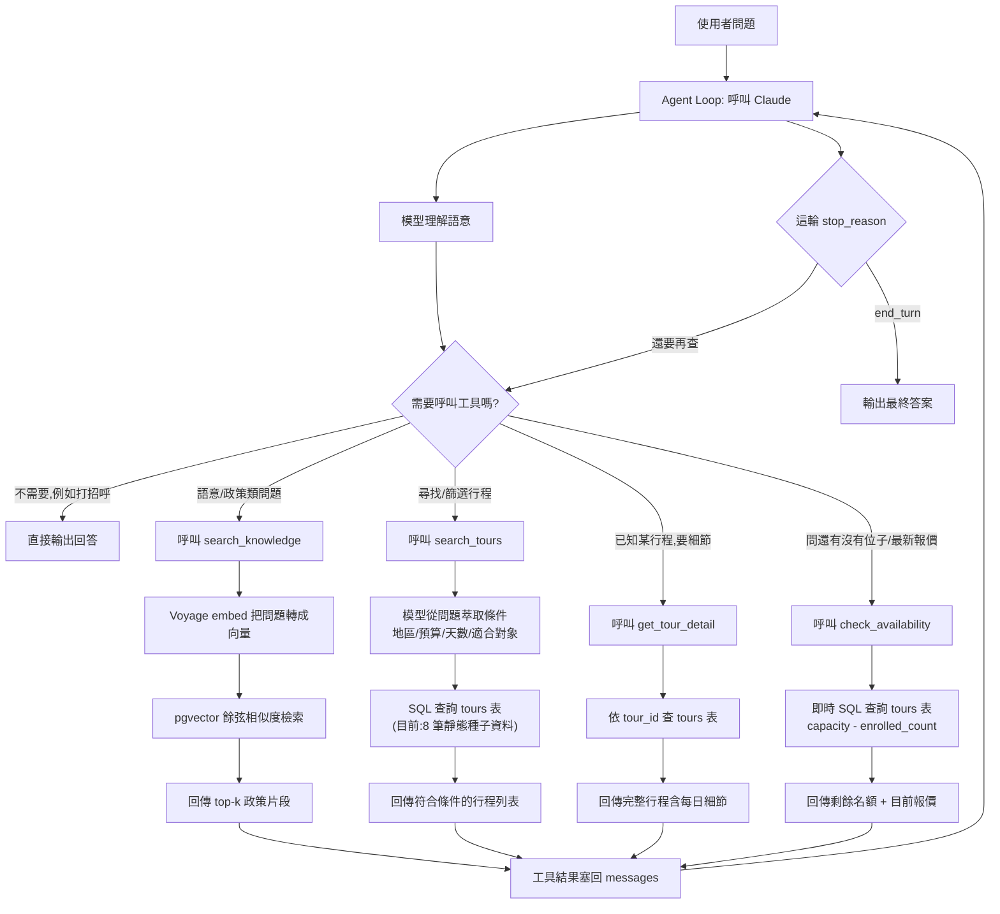

# Agentic RAG Travel Assistant

A multi-step agentic loop (Claude tool use) that routes between
semantic retrieval (RAG over a small travel-policy knowledge base) and
structured tool calls (querying a tour catalog), deciding autonomously
which path -- or how many steps -- a question needs. Implemented
twice: once hand-rolled (no framework, to demonstrate the mechanics),
once with `langchain`/`langgraph` (to match what the target job
postings actually ask for) -- same tools, same prompt, same underlying
queries, so the two are a direct, fair comparison rather than one
being a strawman for the other.

## Stack

FastAPI, Claude (Anthropic API), Voyage embeddings, Postgres + pgvector
(Supabase), Next.js frontend (separate project) consuming this API over
SSE for streamed decision visualization. Both implementations sit
behind the same `POST /chat` endpoint, selected per-request via an
`impl` field.

## Architecture

The model decides per-turn whether it needs a tool at all, and if so,
which one -- routing is driven entirely by the tool descriptions and
system prompt, not hardcoded branching. Policy questions go through
semantic RAG (embedding + pgvector similarity, since policy text has
no fixed structure); tour questions go through structured SQL
(`tours` table has real columns to filter on, so no embedding is
needed). Both paths are tool calls the model chooses between in the
same loop, and it can call several -- sequentially or in parallel --
before producing a final answer.



Every tour-path tool (`search_tours`/`get_tour_detail`/`check_availability`)
queries a real Postgres table with real SQL, live, per request -- there
is no cached/precomputed answer anywhere in this path. `check_availability`
specifically exists to demonstrate that this isn't a static FAQ bot:
"這團還有位子嗎" always re-reads `capacity - enrolled_count` from the
database at the moment it's asked, not a number baked into the prompt
or a snapshot from ingestion time. The table happens to be seeded from
8 hand-written rows (`data/tours.json`) rather than a production
inventory system, but that's a data-volume difference, not an
architectural one -- swapping in a real product database wouldn't
change this diagram at all, only what's behind `tours`.

## Setup

```bash
uv sync
cp .env.example .env   # fill in ANTHROPIC_API_KEY, VOYAGE_API_KEY, DATABASE_URL
```

Run `db/schema.sql` once against the Supabase project (SQL Editor, or
`psql "$DATABASE_URL" -f db/schema.sql`) to create the `tours` and
`policy_chunks` tables plus the `match_policy_chunks` retrieval function,
then seed it:

```bash
uv run python -m app.scripts.seed
uv run uvicorn app.main:app --reload
```

`GET /health` checks the app is up and the DB pool can reach Postgres.
`POST /chat` (`{"message": "...", "impl": "handrolled" | "langchain"}`)
streams the agent's run as SSE -- see the Next.js frontend project for
the UI that consumes it, or drive it directly from the terminal:

```bash
uv run python -m app.scripts.chat_cli "退訂政策是什麼?"
uv run python -m app.scripts.chat_cli_langchain "退訂政策是什麼?"
```

## Project layout

```
app/
  main.py           FastAPI app, lifespan-managed DB pool, CORS
  config.py         pydantic-settings (env vars)
  db.py             psycopg async connection pool
  routers/
    chat.py         POST /chat -- SSE stream, picks handrolled/langchain by impl
  agent/
    loop.py          hand-rolled agentic loop (no framework)
    tools.py         tool registry + dispatch for the hand-rolled loop
    events.py        the AgentEvent union both implementations stream
    langchain_loop.py    same agent, built with langchain.agents.create_agent
    langchain_tools.py   same 3 tools, as @tool-decorated functions
  rag/               embedding (Voyage) + chunking + pgvector retrieval
  tours/
    queries.py       structured SQL search_tours/get_tour_detail
  scripts/
    seed.py                  seeds tours.json + policies/*.md
    chat_cli.py               terminal harness, hand-rolled loop
    chat_cli_langchain.py     terminal harness, LangChain loop
db/
  schema.sql        pgvector schema + match_policy_chunks function
data/
  tours.json        8 seed tours (structured fields + itinerary)
  policies/         8 hand-written policy documents (source for RAG)
tests/
```

## Testing

```bash
uv run pytest
uv run ruff check .
uv run pyright
```
